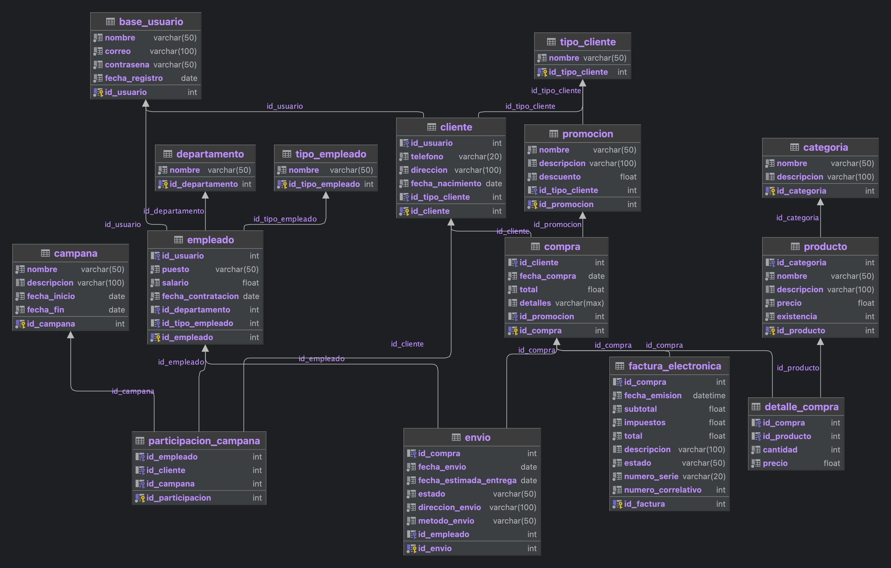

# Proyecto de Base de Datos para un Negocio de Venta de Productos en SQL Server

## Descripción

<p>Este proyecto consiste en el diseño de una base de datos para un negocio de venta de productos.<br>
El negocio cuenta con una tienda física y una tienda en línea. <br>
La tienda física cuenta con un sistema de punto de venta, mientras que la tienda en línea cuenta con un sistema de <br>
comercio electrónico. La base de datos esta en Sql Server</p>





### creacion de la base de datos

```sql
-- Creación de la base de datos
CREATE DATABASE tienda;
```


### Tabla `base_usuario`

| Columna        | Tipo         | Restriccion | Descripción                               | 
|----------------|--------------|-------------|-------------------------------------------|
| id_usuario     | int          | PK          | Llave primaria, identificador del usuario |
| nombre         | varchar(50)  | NOT NULL    | Nombre del usuario                        |
| correo         | varchar(100) | NOT NULL    | Correo electrónico del usuario            |
| contrasena     | varchar(50)  | NOT NULL    | Contraseña del usuario                    |
| fecha_registro | date         | NOT NULL    | Fecha de registro del usuario             |

#### Detalle de la tabla `base_usuario`

<p>La tabla `base_usuario` contiene la información de los usuarios registrados en el sistema. Esta tabla es la base <br>
para las tablas `cliente` y `empleado`, las cuales contienen información adicional de los usuarios.?</p>


### Creación de la tabla `base_usuario`

```sql
-- Tabla usuario
CREATE TABLE base_usuario ( 
    id_usuario INT IDENTITY(1,1) PRIMARY KEY,
    nombre VARCHAR(50) NOT NULL, 
    correo VARCHAR(100) NOT NULL, 
    contrasena VARCHAR(50) NOT NULL,
     fecha_registro DATE NOT NULL);
```

### Ejemplo de inserción de datos en la tabla `base_usuario`

```sql
-- Inserción de 10 datos en la tabla base_usuario
INSERT INTO base_usuario (nombre, correo, contrasena, fecha_registro) VALUES
('Juan Perez', 'jp@mail.com', '123456', '2021-01-01'),
('Maria Lopez', 'ml@mail.com', '123456', '2021-01-01'),
('Pedro Ramirez', 'pr@mail.com', '123456', '2021-01-01'),
('Ana Rodriguez', 'ar@mail.com', '123456', '2021-01-01'),
('Jose Gonzalez', 'jg@mail.com', '123456', '2021-01-01'),
('Luis Martinez', 'lm@mail.com', '123456', '2021-01-01'),
('Laura Sanchez', 'ls@mail.com', '123456', '2021-01-01'),
('Miguel Hernandez', 'mh@mail.com', '123456', '2021-01-01'),
('Gabriela Torres', 'gt@mail.com', '123456', '2021-01-01'),
('Diego Garcia', 'dg@mail.com', '123456', '2021-01-01'),
('Fernanda Ortiz', 'fo@mail.com', '123456', '2021-01-01'),
('Mario Reyes', 'mr@mail.com', '123456', '2021-01-01'),
('Sofia Sandoval', 'ss@mail.com', '123456', '2021-01-01'),
('Hector Jimenez', 'hj@mail.com', '123456', '2021-01-01'),
('Carla Flores', 'cf@mail.com', '123456', '2021-01-01'),
('Antonio Fernandez', 'af@mail.com', '123456', '2021-01-01'),
('Isabella Martinez', 'im@mail.com', '123456', '2021-01-01'),
('Daniel Perez', 'dp@mail.com', '123456', '2021-01-01'),
('Lucia Garcia', 'lg@mail.com', '123456', '2021-01-01'),
('Javier Rodriguez', 'jr@mail.com', '123456', '2021-01-01'),
('Elena Hernandez', 'eh@mail.com', '123456', '2021-01-01'),
('Andres Chavez', 'ac@mail.com', '123456', '2021-01-01'),
('Monica Ortiz', 'mo@mail.com', '123456', '2021-01-01'),
('Ricardo Flores', 'rf@mail.com', '123456', '2021-01-01'),
('Julia Torres', 'jt@mail.com', '123456', '2021-01-01');
```


### Tabla `cliente`

| Columna          | Tipo         | Restriccion | Descripción                                      |
|------------------|--------------|-------------|--------------------------------------------------|
| id_cliente       | int          | PK          | Llave primaria, identificador del cliente        |
| id_usuario       | int          | FK          | Llave foránea, identificador del usuario         |
| telefono         | varchar(20)  | NOT NULL    | Teléfono del cliente                             |
| direccion        | varchar(100) | NOT NULL    | Dirección del cliente                            |
| fecha_nacimiento | date         | NOT NULL    | Fecha de nacimiento del cliente                  |
| id_tipo_cliente  | int          | FK          | Llave foránea, identificador del tipo de cliente |

#### Detalle de la tabla `cliente`

<p>La tabla `cliente` contiene la información de los clientes registrados en el sistema. Esta tabla es la base <br>
para las tablas `compra` y `participacion_campana`, las cuales contienen información adicional de los clientes.</p>

### Creación de la tabla `cliente`

```sql
-- Tabla cliente
CREATE TABLE cliente (
    id_cliente INT IDENTITY(1,1) PRIMARY KEY,
    id_usuario INT FOREIGN KEY REFERENCES base_usuario(id_usuario),
    telefono VARCHAR(20) NOT NULL,
    direccion VARCHAR(100) NOT NULL,
    fecha_nacimiento DATE NOT NULL,
    id_tipo_cliente INT FOREIGN KEY REFERENCES tipo_cliente(id_tipo_cliente)
);
```

### Ejemplo de inserción de datos en la tabla `cliente`

```sql
-- Inserción de 10 datos en la tabla cliente
INSERT INTO cliente (id_usuario, telefono, direccion, fecha_nacimiento, id_tipo_cliente) VALUES(1, '1234567890', 'Calle 1 #123', '1990-01-01', 1),
(2, '2345678901', 'Calle 2 #234', '1992-02-02', 2),
(3, '3456789012', 'Calle 3 #345', '1994-03-03', 1),
(4, '4567890123', 'Calle 4 #456', '1996-04-04', 2),
(5, '5678901234', 'Calle 5 #567', '1998-05-05', 1),
(6, '6789012345', 'Calle 6 #678', '2000-06-06', 2),
(7, '7890123456', 'Calle 7 #789', '2002-07-07', 1),
(8, '8901234567', 'Calle 8 #890', '2004-08-08', 2),
(9, '9012345678', 'Calle 9 #901', '2006-09-09', 1),
(10, '0123456789', 'Calle 10 #012', '2008-10-10', 2);
```

### Tabla `empleado`

| Columna            | Tipo        | Restriccion | Descripción                                       |
|--------------------|-------------|-------------|---------------------------------------------------|
| id_empleado        | int         | PK          | Llave primaria, identificador del empleado        |
| id_usuario         | int         | FK          | Llave foránea, identificador del usuario          |
| puesto             | varchar(50) | NOT NULL    | Puesto del empleado                               |
| salario            | float       | NOT NULL    | Salario del empleado                              |
| fecha_contratacion | date        | NOT NULL    | Fecha de contratación del empleado                |
| id_departamento    | int         | FK          | Llave foránea, identificador del departamento     |
| id_tipo_empleado   | int         | FK          | Llave foránea, identificador del tipo de empleado |

#### Detalle de la tabla `empleado`

<p>La tabla `empleado` contiene la información de los empleados registrados en el sistema.</p>

### Creación de la tabla `empleado`

```sql
-- Tabla empleado
CREATE TABLE empleado (
    id_empleado INT IDENTITY(1,1) PRIMARY KEY,
    id_usuario INT FOREIGN KEY REFERENCES base_usuario(id_usuario),
    puesto VARCHAR(50) NOT NULL,
    salario FLOAT NOT NULL,
    fecha_contratacion DATE NOT NULL,
    id_departamento INT FOREIGN KEY REFERENCES departamento(id_departamento),
    id_tipo_empleado INT FOREIGN KEY REFERENCES tipo_empleado(id_tipo_empleado)
);
```

### Ejemplo de inserción de datos en la tabla `empleado`

```sql
-- Inserción de datos en la tabla empleado

INSERT INTO empleado (id_usuario, puesto, salario, fecha_contratacion, id_departamento, id_tipo_empleado) VALUES
(11, 'Gerente', 1000000, '2021-01-01', 1, 1),
(12, 'Analista de Sistemas', 800000, '2021-02-01', 2, 2),
(13, 'Contador', 700000, '2021-03-01', 3, 3),
(14, 'Encargado de Ventas', 900000, '2021-04-01', 4, 1),
(15, 'Diseñador Gráfico', 750000, '2021-05-01', 5, 2),
(16, 'Ingeniero Civil', 850000, '2021-06-01', 6, 3),
(17, 'Supervisor de Producción', 950000, '2021-07-01', 7, 1),
(18, 'Abogado', 750000, '2021-08-01', 8, 2),
(19, 'Chef Ejecutivo', 800000, '2021-09-01', 9, 3),
(20, 'Gerente de Logistica', 600000, '2021-10-01', 10, 1);

```


### Tabla `categoria`

| Columna      | Tipo         | Restriccion | Descripción                                   |
|--------------|--------------|-------------|-----------------------------------------------|
| id_categoria | int          | PK          | Llave primaria, identificador de la categoría |    
| nombre       | varchar(50)  | NOT NULL    | Nombre de la categoría                        |
| descripcion  | varchar(100) | NOT NULL    | Descripción de la categoría                   |

#### Detalle de la tabla `categoria`

<p>La tabla `categoria` contiene la información de las categorías de los productos.</p>

### Creación de la tabla `categoria`

```sql
-- Tabla categoria
CREATE TABLE categoria (
    id_categoria INT IDENTITY(1,1) PRIMARY KEY,
    nombre VARCHAR(50) NOT NULL,
    descripcion VARCHAR(100)
);
```

### Ejemplo de inserción de datos en la tabla `categoria`

```sql
-- Inserción de datos en la tabla categoria
INSERT INTO categoria (nombre, descripcion) VALUES
('Computadoras', 'Categoría de productos informáticos y electrónicos'),
('Tablets', 'Categoría de tablets y accesorios'),
('Smartphones', 'Categoría de teléfonos móviles y accesorios'),
('Audio y Video', 'Categoría de productos de audio y video'),
('Impresoras y Consumibles', 'Categoría de impresoras, cartuchos y tóners');
```

### Tabla `producto`

| Columna      | Tipo         | Restriccion | Descripción                                  |
|--------------|--------------|-------------|----------------------------------------------|
| id_producto  | int          | PK          | Llave primaria, identificador del producto   |
| id_categoria | int          | FK          | Llave foránea, identificador de la categoría |
| nombre       | varchar(50)  | NOT NULL    | Nombre del producto                          |
| descripcion  | varchar(100) | NOT NULL    | Descripción del producto                     |
| precio       | float        | NOT NULL    | Precio del producto                          |
| existencia   | int          | NOT NULL    | Existencia del producto                      |

#### Detalle de la tabla `producto`

<p>La tabla `producto` contiene la información de los productos registrados en el sistema.</p>

### Creación de la tabla `producto`

```sql
-- Tabla producto
CREATE TABLE producto (
    id_producto INT IDENTITY(1,1) PRIMARY KEY,
    id_categoria INT FOREIGN KEY REFERENCES categoria(id_categoria),
    nombre VARCHAR(50) NOT NULL,
    descripcion VARCHAR(100),
    precio FLOAT NOT NULL,
    existencia INT NOT NULL
);
```

### Ejemplo de inserción de datos en la tabla `producto`

```sql
-- Inserción de datos en la tabla producto
INSERT INTO producto (id_categoria, nombre, descripcion, precio, existencia) VALUES
(1, 'Laptop Lenovo IdeaPad', 'Laptop de 15.6 pulgadas con procesador Intel Core i5 y memoria RAM de 8GB', 12000, 25),
(1, 'PC Gamer ASUS TUF', 'Computadora de escritorio con procesador AMD Ryzen 5 y tarjeta gráfica NVIDIA GeForce GTX 1650', 20000, 10),
(1, 'MacBook Pro 13"', 'Laptop de 13 pulgadas con procesador Apple M1 y memoria RAM de 8GB', 30000, 5),
(2, 'Tablet Samsung Galaxy Tab S7', 'Tablet de 11 pulgadas con procesador Qualcomm Snapdragon 865 Plus y memoria RAM de 6GB', 15000, 15),
(2, 'Funda para Tablet', 'Funda protectora para tablet con soporte ajustable y cierre magnético', 500, 50),
(2, 'Cargador de Pared para Tablet', 'Cargador de pared con puerto USB para cargar tabletas y otros dispositivos', 300, 40),
(3, 'iPhone 13', 'Smartphone de Apple con pantalla OLED de 6.1 pulgadas y triple cámara trasera', 25000, 10),
(3, 'Samsung Galaxy S21', 'Smartphone de Samsung con pantalla AMOLED de 6.2 pulgadas y cámara trasera de 64MP', 20000, 20),
(3, 'Xiaomi Redmi Note 10 Pro', 'Smartphone de Xiaomi con pantalla AMOLED de 6.67 pulgadas y cámara trasera de 108MP', 10000, 30),
(4, 'Audífonos Bose QuietComfort 35 II', 'Audífonos inalámbricos con cancelación de ruido y batería de hasta 20 horas', 8000, 10),
(4, 'Barra de Sonido Sony HT-S350', 'Barra de sonido de 2.1 canales con potencia de 320W y tecnología Bluetooth', 6000, 15),
(4, 'Proyector Epson Home Cinema', 'Proyector de cine en casa con resolución Full HD y brillo de 3100 lúmenes', 15000, 5),
(5, 'Impresora HP OfficeJet Pro 9015e', 'Impresora multifuncional con conexión Wi-Fi y capacidad para impresión automática a doble cara', 5000, 8),
(5, 'Tóner HP 94A', 'Cartucho de tóner para impresoras HP LaserJet Pro', 1000, 20),
(5, 'Papel Fotográfico Epson Premium Glossy', 'Papel fotográfico de alta calidad con acabado brillante', 300, 100);
```

### Tabla `promocion`

| Columna         | Tipo         | Restriccion | Descripción                                      |
|-----------------|--------------|-------------|--------------------------------------------------|
| id_promocion    | int          | PK          | Llave primaria, identificador de la promoción    |
| id_tipo_cliente | int          | FK          | Llave foránea, identificador del tipo de cliente |
| nombre          | varchar(50)  | NOT NULL    | Nombre de la promoción                           |
| descripcion     | varchar(100) | NOT NULL    | Descripción de la promoción                      |
| descuento       | float        | NOT NULL    | Descuento de la promoción                        |
| id_tipo_cliente | int          | FK          | Llave foránea, identificador del tipo de cliente |

#### Detalle de la tabla `promocion`

<p>La tabla `promocion` contiene la información de las promociones registradas en el sistema.</p>

### Creación de la tabla `promocion`

```sql
-- Tabla promocion
CREATE TABLE promocion (
    id_promocion INT IDENTITY(1,1) PRIMARY KEY,
    nombre VARCHAR(50) NOT NULL,
    descripcion VARCHAR(100),
    descuento FLOAT NOT NULL,
    id_tipo_cliente INT FOREIGN KEY REFERENCES tipo_cliente(id_tipo_cliente)
);
```

### Ejemplo de inserción de datos en la tabla `promocion`

```sql
-- Inserción de datos en la tabla promocion
INSERT INTO promocion (nombre, descripcion, descuento, id_tipo_cliente) VALUES
('Promoción de verano', 'Descuento del 20% en todos los productos de la tienda para clientes premium', 20, 1),
('Descuento de bienvenida', 'Descuento del 10% en tu primera compra en la tienda', 10, 2),
('Oferta de lanzamiento', 'Descuento del 15% en productos nuevos de la categoría de smartphones', 15, 3),
('Día del padre', 'Descuento del 25% en productos de la categoría de audio y video', 25, 2),
('Promoción de navidad', 'Descuento del 30% en compras mayores a $100 en la tienda', 30, 1);
```

### Tabla `compra`

| Columna      | Tipo         | Restriccion | Descripción                                  |
|--------------|--------------|-------------|----------------------------------------------|
| id_compra    | int          | PK          | Llave primaria, identificador de la compra   |
| id_cliente   | int          | FK          | Llave foránea, identificador del cliente     |
| fecha_compra | date         | NOT NULL    | Fecha de la compra                           |
| total        | float        | NOT NULL    | Total de la compra                           |
| detalles     | varchar(MAX) | NOT NULL    | Detalles de la compra                        |
| id_promocion | int          | FK          | Llave foránea, identificador de la promoción |

#### Detalle de la tabla `compra`

<p>La tabla `compra` contiene la información de las compras registradas en el sistema.</p>

### Creación de la tabla `compra`

```sql

-- Tabla compra
CREATE TABLE compra (
    id_compra INT IDENTITY(1,1) PRIMARY KEY,
    id_cliente INT FOREIGN KEY REFERENCES cliente(id_cliente),
    fecha_compra DATE NOT NULL,
    total FLOAT NOT NULL,
    detalles VARCHAR(MAX),
    id_promocion INT FOREIGN KEY REFERENCES promocion(id_promocion)
);
```

### Ejemplo de inserción de datos en la tabla `compra`

```sql
-- Inserción de datos en la tabla compra
INSERT INTO compra (id_cliente, fecha_compra, total, detalles, id_promocion) VALUES
(1, '2022-05-20', 700, 'Compra de una tablet y un cargador', NULL),
(2, '2022-05-21', 400, 'Compra de una batería para smartphone', 2),
(3, '2022-05-22', 1500, 'Compra de una laptop y una impresora', 1),
(4, '2022-05-23', 800, 'Compra de dos audífonos inalámbricos', NULL),
(5, '2022-05-24', 1200, 'Compra de un smartphone y una tarjeta de memoria', 5),
(6, '2022-05-25', 1000, 'Compra de una tablet y una funda', NULL),
(7, '2022-05-26', 350, 'Compra de una película en formato Blu-ray', NULL),
(8, '2022-05-27', 600, 'Compra de una impresora y un cartucho', 2),
(9, '2022-05-28', 450, 'Compra de una carcasa para smartphone', NULL),
(10, '2022-05-29', 1000, 'Compra de una laptop y un mouse', 1),
(1, '2022-06-01', 800, 'Compra de una bocina inalámbrica', 1),
(2, '2022-06-03', 500, 'Compra de un cargador para smartphone', NULL),
(3, '2022-06-04', 1200, 'Compra de una laptop y un teclado', 5),
(4, '2022-06-07', 400, 'Compra de un protector de pantalla para smartphone', 2),
(5, '2022-06-09', 1500, 'Compra de una laptop y una mochila', 1),
(6, '2022-06-12', 700, 'Compra de una tablet y un cargador', NULL),
(7, '2022-06-14', 350, 'Compra de una película en formato DVD', NULL),
(8, '2022-06-17', 450, 'Compra de una carcasa para smartphone', NULL),
(9, '2022-06-20', 1200, 'Compra de un smartphone y una tarjeta de memoria', NULL),
(10, '2022-06-22', 800, 'Compra de una bocina inalámbrica', 1);
```

### Tabla `detalle_compra`

| Columna     | Tipo  | Restriccion | Descripción                               |
|-------------|-------|-------------|-------------------------------------------|
| id_compra   | int   | FK          | Llave foránea, identificador de la compra |
| id_producto | int   | FK          | Llave foránea, identificador del producto |
| cantidad    | int   | NOT NULL    | Cantidad del producto                     |
| precio      | float | NOT NULL    | Precio del producto                       |

#### Detalle de la tabla `detalle_compra`

<p>La tabla `detalle_compra` contiene la información de los detalles de las compras registradas en el sistema.</p>

### Creación de la tabla `detalle_compra`

```sql
-- Tabla detalle_compra
CREATE TABLE detalle_compra (
    id_compra INT FOREIGN KEY REFERENCES compra(id_compra),
    id_producto INT FOREIGN KEY REFERENCES producto(id_producto),
    cantidad INT NOT NULL,
    precio FLOAT NOT NULL
);
```

### Ejemplo de inserción de datos en la tabla `detalle_compra`

```sql
-- Inserción de datos en la tabla detalle_compra
INSERT INTO detalle_compra (id_compra, id_producto, cantidad, precio) VALUES
(1, 1, 2, 1500),
(1, 3, 1, 2000),
(2, 4, 1, 350),
(2, 6, 3, 100),
(3, 7, 2, 800),
(4, 9, 1, 10000),
(5, 11, 1, 500),
(6, 12, 2, 4000),
(7, 15, 3, 300),
(8, 16, 1, 2000);
```

### Tabla `campana`

| Columna      | Tipo         | Restriccion | Descripción                                 |
|--------------|--------------|-------------|---------------------------------------------|
| id_campana   | int          | PK          | Llave primaria, identificador de la campaña |
| nombre       | varchar(50)  | NOT NULL    | Nombre de la campaña                        |
| descripcion  | varchar(100) | NOT NULL    | Descripción de la campaña                   |
| fecha_inicio | date         | NOT NULL    | Fecha de inicio de la campaña               |
| fecha_fin    | date         | NOT NULL    | Fecha de fin de la campaña                  |

#### Detalle de la tabla `campana`

<p>La tabla `campana` contiene la información de las campañas registradas en el sistema.</p>

### Creación de la tabla `campana`

```sql

-- Tabla campana
CREATE TABLE campana (
    id_campana INT IDENTITY(1,1) PRIMARY KEY,
    nombre VARCHAR(50) NOT NULL,
    descripcion VARCHAR(100),
    fecha_inicio DATE NOT NULL,
    fecha_fin DATE NOT NULL
);
```

### Ejemplo de inserción de datos en la tabla `campana`

```sql
-- Inserción de datos en la tabla campana
INSERT INTO campana (nombre, descripcion, fecha_inicio, fecha_fin) VALUES
('Oferta del Mes', 'Descuentos especiales en productos seleccionados', '2023-06-01', '2023-06-30'),
('Regreso a Clases', 'Promociones en laptops y tablets', '2023-07-15', '2023-08-15'),
('Black Friday', 'Descuentos de hasta un 50% en productos seleccionados', '2023-11-24', '2023-11-26'),
('Navidad en Tecnología', 'Promociones especiales en smartphones y dispositivos de audio', '2023-12-01', '2023-12-31'),
('Ofertas de Verano', 'Descuentos en accesorios para dispositivos móviles', '2023-06-15', '2023-07-15');

```

### Tabla `participacion_campana`

| Columna          | Tipo | Restriccion | Descripción                                       |
|------------------|------|-------------|---------------------------------------------------|
| id_participacion | int  | PK          | Llave primaria, identificador de la participación |
| id_empleado      | int  | FK          | Llave foránea, identificador del empleado         |
| id_cliente       | int  | FK          | Llave foránea, identificador del cliente          |
| id_campana       | int  | FK          | Llave foránea, identificador de la campaña        |

#### Detalle de la tabla `participacion_campana`

<p>La tabla `participacion_campana` contiene la información de las participaciones de los empleados y <br>
clientes en las campañas registradas en el sistema.</p>

### Creación de la tabla `participacion_campana`

```sql

-- Tabla participacion_campana
CREATE TABLE participacion_campana (
    id_participacion INT IDENTITY(1,1) PRIMARY KEY,
    id_empleado INT FOREIGN KEY REFERENCES empleado(id_empleado),
    id_cliente INT FOREIGN KEY REFERENCES cliente(id_cliente),
    id_campana INT FOREIGN KEY REFERENCES campana(id_campana)
);
```

### Ejemplo de inserción de datos en la tabla `participacion_campana`

```sql
-- Inserción de datos en la tabla participacion_campana
INSERT INTO participacion_campana (id_empleado, id_cliente, id_campana) VALUES
(1, 2, 1),
(3, 5, 2),
(2, 7, 1),
(4, 9, 3),
(1, 10, 2);
```

### Tabla `envio`

| Columna                | Tipo         | Restriccion | Descripción                               |
|------------------------|--------------|-------------|-------------------------------------------|
| id_envio               | int          | PK          | Llave primaria, identificador del envío   |
| id_compra              | int          | FK          | Llave foránea, identificador de la compra |
| fecha_envio            | date         | NOT NULL    | Fecha de envío                            |
| fecha_estimada_entrega | date         | NOT NULL    | Fecha estimada de entrega                 |
| estado                 | varchar(50)  | NOT NULL    | Estado del envío                          |
| direccion_envio        | varchar(100) | NOT NULL    | Dirección de envío                        |
| metodo_envio           | varchar(50)  | NOT NULL    | Método de envío                           |
| id_empleado            | int          | FK          | Llave foránea, identificador del empleado |

#### Detalle de la tabla `envio`

<p>La tabla `envio` contiene la información de los envíos registrados en el sistema.</p>

### Creación de la tabla `envio`

```sql
-- Tabla envio
CREATE TABLE envio (
    id_envio INT IDENTITY(1,1) PRIMARY KEY,
    id_compra INT FOREIGN KEY REFERENCES compra(id_compra),
    fecha_envio DATE NOT NULL,
    fecha_estimada_entrega DATE NOT NULL,
    estado VARCHAR(50) NOT NULL,
    direccion_envio VARCHAR(100) NOT NULL,
    metodo_envio VARCHAR(50) NOT NULL,
    id_empleado INT FOREIGN KEY REFERENCES empleado(id_empleado)
);

-- Restricción de clave foránea en la tabla envio
ALTER TABLE envio WITH CHECK ADD CONSTRAINT FK_empleado_envio FOREIGN KEY (id_empleado) REFERENCES empleado(id_empleado);
```

### Ejemplo de inserción de datos en la tabla `envio`

```sql
-- Inserción de datos en la tabla envio
INSERT INTO envio (id_compra, fecha_envio, fecha_estimada_entrega, estado, direccion_envio, metodo_envio, id_empleado) VALUES
(1, '2022-05-21', '2022-05-28', 'Enviado', 'Calle 123, Ciudad de México', 'Estafeta', 20),
(2, '2022-05-22', '2022-05-28', 'Enviado', 'Avenida 456, Guadalajara', 'FedEx', 20),
(3, '2022-05-23', '2022-05-30', 'Enviado', 'Calle 789, Monterrey', 'DHL', 20),
(4, '2022-05-24', '2022-06-01', 'Enviado', 'Calle 111, Ciudad de México', 'Estafeta', 20),
(5, '2022-05-25', '2022-06-01', 'Enviado', 'Avenida 222, Guadalajara', 'FedEx', 20),
(6, '2022-05-26', '2022-06-02', 'Enviado', 'Calle 333, Monterrey', 'DHL', 20),
(7, '2022-05-27', '2022-06-03', 'Enviado', 'Calle 444, Ciudad de México', 'Estafeta', 20),
(8, '2022-05-30', '2022-06-06', 'Enviado', 'Avenida 555, Guadalajara', 'FedEx', 20),
(9, '2022-05-31', '2022-06-07', 'Enviado', 'Calle 666, Monterrey', 'DHL', 20);
```

### Tabla `factura_electronica`

| Columna            | Tipo         | Restriccion | Descripción                                 |
|--------------------|--------------|-------------|---------------------------------------------|
| id_factura         | int          | PK          | Llave primaria, identificador de la factura |
| id_compra          | int          | FK          | Llave foránea, identificador de la compra   |
| fecha_emision      | datetime     | NOT NULL    | Fecha de emisión de la factura              |
| subtotal           | float        | NOT NULL    | Subtotal de la factura                      |
| impuestos          | float        | NOT NULL    | Impuestos de la factura                     |
| total              | float        | NOT NULL    | Total de la factura                         |
| descripcion        | varchar(100) | NOT NULL    | Descripción de la factura                   |
| estado             | varchar(50)  | NOT NULL    | Estado de la factura                        |
| numero_serie       | varchar(20)  | NOT NULL    | Número de serie de la factura               |
| numero_correlativo | int          | NOT NULL    | Número correlativo de la factura            |

#### Detalle de la tabla `factura_electronica`

<p>La tabla `factura_electronica` contiene la información de las facturas registradas en el sistema.</p>

### Creación de la tabla `factura_electronica`

```sql
-- Tabla factura_electronica
CREATE TABLE factura_electronica (
    id_factura INT IDENTITY(1,1) PRIMARY KEY,
    id_compra INT FOREIGN KEY REFERENCES compra(id_compra),
    fecha_emision DATETIME NOT NULL,
    subtotal FLOAT NOT NULL,
    impuestos FLOAT NOT NULL,
    total FLOAT NOT NULL,
    descripcion VARCHAR(100),
    estado VARCHAR(50) NOT NULL,
    numero_serie VARCHAR(20) NOT NULL,
    numero_correlativo INT NOT NULL
);
```

### Ejemplo de inserción de datos en la tabla `factura_electronica`

```sql
-- Inserción de datos en la tabla factura_electronica   
INSERT INTO factura_electronica (id_compra, fecha_emision, subtotal, impuestos, total, descripcion, estado, numero_serie, numero_correlativo) VALUES
(1, '2022-05-20', 700, 84, 784, 'Factura de compra de una tablet y un cargador', 'Pagado', '001', '00001'),
(2, '2022-05-21', 400, 48, 448, 'Factura de compra de una batería para smartphone', 'Pendiente', '001', '00002'),
(3, '2022-05-22', 1500, 180, 1680, 'Factura de compra de una laptop y una impresora', 'Pagado', '001', '00003'),
(4, '2022-05-23', 800, 96, 896, 'Factura de compra de dos audífonos inalámbricos', 'Enviado', '001', '00004'),
(5, '2022-05-24', 1200, 144, 1344, 'Factura de compra de un smartphone y una tarjeta de memoria', 'Entregado', '001', '00005'),
(6, '2022-05-25', 1000, 120, 1120, 'Factura de compra de una tablet y una funda', 'Pagado', '001', '00006'),
(7, '2022-05-26', 350, 42, 392, 'Factura de compra de una película en formato Blu-ray', 'Pendiente', '001', '00007'),
(8, '2022-05-27', 600, 72, 672, 'Factura de compra de una impresora y un cartucho', 'Enviado', '001', '00008'),
(9, '2022-05-28', 450, 54, 504, 'Factura de compra de una carcasa para smartphone', 'Entregado', '001', '00009'),
(10, '2022-05-29', 1000, 120, 1120, 'Factura de compra de una laptop y un mouse', 'Pagado', '001', '00010');
```

### Tabla `departamento`

| Columna         | Tipo        | Restriccion | Descripción                                    |
|-----------------|-------------|-------------|------------------------------------------------|
| id_departamento | int         | PK          | Llave primaria, identificador del departamento |
| nombre          | varchar(50) | NOT NULL    | Nombre del departamento                        |

#### Detalle de la tabla `departamento`

<p>La tabla `departamento` contiene la información de los departamentos registrados en el sistema.</p>

### Creación de la tabla `departamento`

```sql
-- Tabla departamento
CREATE TABLE departamento (
    id_departamento INT IDENTITY(1,1) PRIMARY KEY,
    nombre VARCHAR(50) NOT NULL
);
```

### Ejemplo de inserción de datos en la tabla `departamento`

```sql
-- Inserción de datos en la tabla departamento
INSERT INTO departamento (nombre) VALUES
('Recursos Humanos'),
('FINANZAS'),
('Ventas'),
('Marketing'),
('Compras'),
('Logística'),
('Almacén'),
('Sistemas'),
('Servicio al cliente'),
('Mantenimiento');
```

### Tabla `tipo_empleado`

| Columna          | Tipo        | Restriccion | Descripción                                        |
|------------------|-------------|-------------|----------------------------------------------------|
| id_tipo_empleado | int         | PK          | Llave primaria, identificador del tipo de empleado |
| nombre           | varchar(50) | NOT NULL    | Nombre del tipo de empleado                        |

#### Detalle de la tabla `tipo_empleado`

<p>La tabla `tipo_empleado` contiene la información de los tipos de empleados registrados en el sistema.</p>

### Creación de la tabla `tipo_empleado`

```sql
-- Tabla tipo_empleado
CREATE TABLE tipo_empleado (
    id_tipo_empleado INT IDENTITY(1,1) PRIMARY KEY,
    nombre VARCHAR(50) NOT NULL
);
```

### Ejemplo de inserción de datos en la tabla `tipo_empleado`

```sql
-- Inserción de datos en la tabla tipo_empleado
INSERT INTO tipo_empleado (nombre) VALUES
('Administrativo'),
('Operativo'),
('Técnico')
```

### Tabla `tipo_cliente`

| Columna         | Tipo        | Restriccion | Descripción                                       |
|-----------------|-------------|-------------|---------------------------------------------------|
| id_tipo_cliente | int         | PK          | Llave primaria, identificador del tipo de cliente |
| nombre          | varchar(50) | NOT NULL    | Nombre del tipo de cliente                        |

#### Detalle de la tabla `tipo_cliente`

<p>La tabla `tipo_cliente` contiene la información de los tipos de clientes registrados en el sistema.</p>

### Creación de la tabla `tipo_cliente`

```sql

-- Tabla tipo_cliente
CREATE TABLE tipo_cliente (
    id_tipo_cliente INT IDENTITY(1,1) PRIMARY KEY,
    nombre VARCHAR(50) NOT NULL
);
```

### Ejemplo de inserción de datos en la tabla `tipo_cliente`

```sql
-- Inserción de datos en la tabla tipo_cliente
INSERT INTO tipo_cliente (nombre) VALUES
('Cliente frecuente'),
('Cliente Gubernamental'),
('Cliente corporativo'),
('Cliente mayorista'),
('Cliente minorista');
```